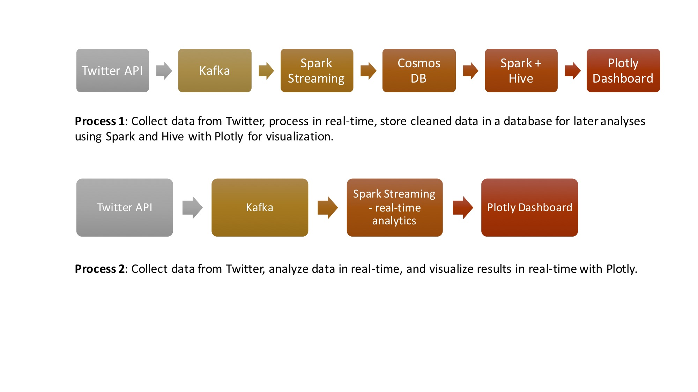

# Recent Trends in ML, AI, and Bigdata news
Goal: tracking trending topics in big data, machine learning, and AI.

There are 2 sources of news to analyze: news sharing through tweets and news from traditional news media. 

## Tweet Streaming
There are 2 experiments conducted with Twitter Streaming data. The high-level workflows are illustrated below. 

For both experiments, streaming tweets are listened by Kafka. Code to connect Twitter API and Kafka can be found at **twitter_to_kafka.py**.

In the first experiment, data are cleaned in real-time for storage using Spark Streaming framework and Python. Code for this process can be found at **tweetcollect_kafka.py**.

In the second experiment, data are cleaned and analyzed in real-time using Spark Streaming framework and Python. The results are updated in seconds in my Plotly Dashboard as below. Code for this part is at **StreamSensing_wVizz.py**.

## Articles Collecting
The workflow for collecting and analyzing articles from traditional news media is below.

## Tweets and News from Articles Joining
Codes to query data from Cosmos DB and prepare dataframes for analysis in Spark can be found at **connect_cosmos_spark.py**

Data retrieved from Cosmos DB are cleaned up further on Spark for the purpose of analysis. Codes can be found at **clean_data_on_spark.py**

LDA analysis was conducted on News corpus at **LDA_news.py**

Full analysis and visualization on Twitter and News data can be found at **twitter_news_analytics.py**

